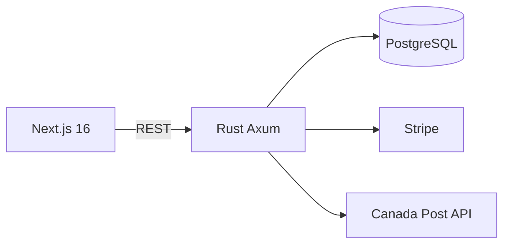

# BeeNorth 3D

Loja online especializada em itens decorativos e utilitários impressos em 3D, com base em Sarnia, Ontario, Canadá. Foco em produtos personalizados de alta qualidade.

## Stack

- **Frontend**: Next.js 16 (App Router, TypeScript, Tailwind 4) no Vercel
- **Backend**: Rust (Axum 0.8 + SQLx + Tokio) no Oracle ARM Free Tier
- **DB**: PostgreSQL 16
- **Pagamentos**: Stripe (Payment Intents)
- **Envios**: Canada Post (cálculo de tarifas + geração de etiquetas completas)
- **Outros**: Cupons, Blog, Newsletter, Auth, Admin, Analytics, Instagram integration

## Destaques

- 25 migrations incluindo shipments, filament colors, quantity discounts, order public tokens
- Integração real com Canada Post para labels de envio
- CI/CD completo (GitHub Actions → cross-compile ARM → deploy Oracle + Vercel)
- Health checks, backups cron, rollback automático

**Live**: [beenorth3d.com](https://beenorth3d.com)
