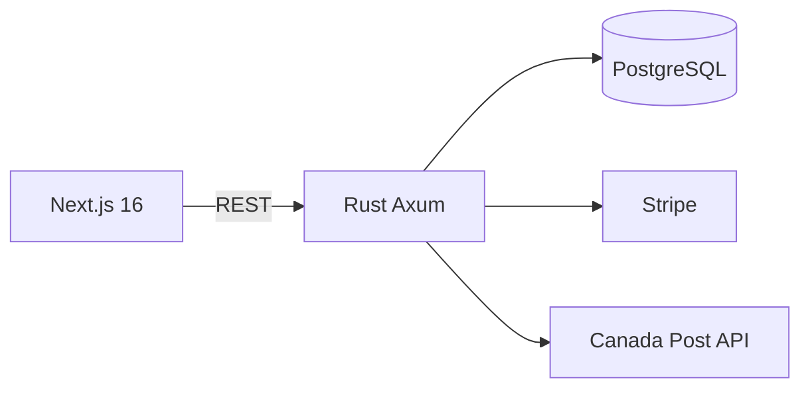

# BeeNorth 3D

Online store specializing in decorative and utilitarian 3D-printed items, based in Sarnia, Ontario, Canada. Focus on high-quality customized products.

## Stack

- **Frontend**: Next.js 16 (App Router, TypeScript, Tailwind 4) on Vercel
- **Backend**: Rust (Axum 0.8 + SQLx + Tokio) on Oracle ARM Free Tier
- **DB**: PostgreSQL 16
- **Payments**: Stripe (Payment Intents)
- **Shipping**: Canada Post (rate calculation + full label generation)
- **Others**: Coupons, Blog, Newsletter, Auth, Admin, Analytics, Instagram integration

## Highlights

- 25 migrations including shipments, filament colors, quantity discounts, order public tokens
- Real integration with Canada Post for shipping labels
- Complete CI/CD (GitHub Actions → cross-compile ARM → deploy Oracle + Vercel)
- Health checks, cron backups, automatic rollback

### Project Visual

**Live**: [beenorth3d.com](https://beenorth3d.com)
