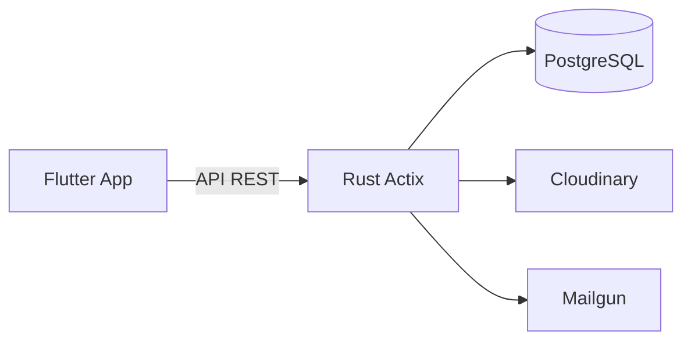

# Igreja Manager

Enterprise platform for church administration, with multi-congregation support, complete internationalization (pt/en/es) and monetization via subscriptions.

## Technology Stack

- **Backend**: Rust (Actix-Web 4.13 + SQLx 0.8)
- **Database**: PostgreSQL 16
- **Frontend**: Flutter (Android, iOS, Web)
- **Infra**: Docker, Vercel (web), Cloudinary, Mailgun

## Main Modules

- Complete member, family and visitor registration
- Financial control (tithes, offerings, reports, chart of accounts)
- Sunday School (EBD) with attendance, lessons and reports
- Ministry management with leaders, events, instruments and permissions
- Biblical Academy (gamified, Duolingo-style)
- Granular Roles & Permissions (multi-role, pastor, owner, etc.)
- Congregations, reports, audit and internationalization support

## Why It Impresses

Over 40 migrations, 30+ architecture and test documents, advanced RBAC, extensive testing and Docker + CI deployment. One of the most complete ecclesiastical management systems in production.

**Live**: [igreja.drumblow.com](https://igreja.drumblow.com)
