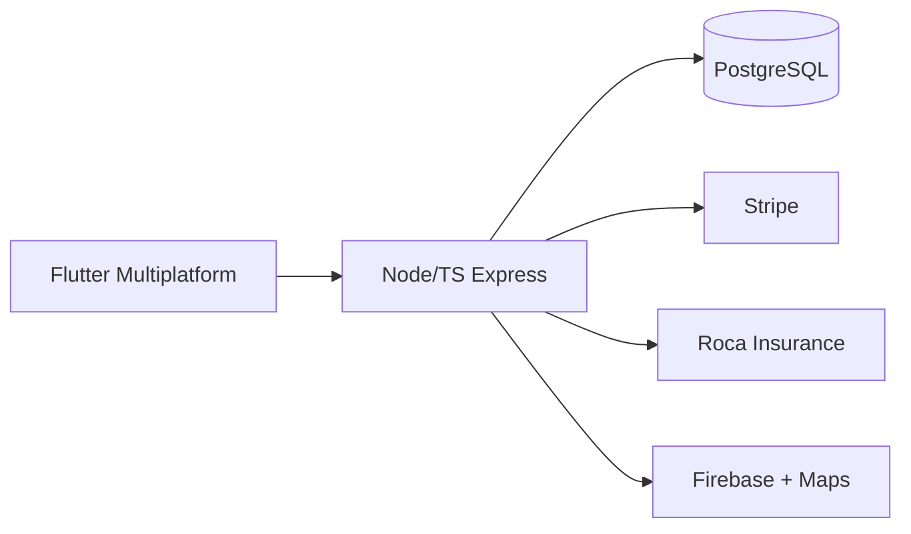

# Jumb

Marketplace platform connecting tourists to local experiences and guides, with full support for international tourists. Large-scale project demonstrating capability in complex, high-volume products.

## Stack and Scale

- **App**: Flutter full cross-platform (Android, iOS, Web, Windows, macOS, Linux)
- **Backend**: Node.js + TypeScript + Express + pg
- **Integrations**: Stripe (payments with fees), Roca Seguros (full insurance flow), Firebase (FCM + Auth), Google Maps / Geocoding, Cloudinary

## Highlights

- ~96,000 lines of code, 31 migrations, over 20 thousand lines of tests (Jest + Flutter)
- CI/CD, Docker, nginx, extensive documentation and deploy guides
- Features: activities, bookings, providers, reviews, notifications, support tickets, KYC, pricing groups, admin

**Status**: Archived after advanced development and production of high-quality documentation and tests. Excellent reference for capability in complex marketplaces.

