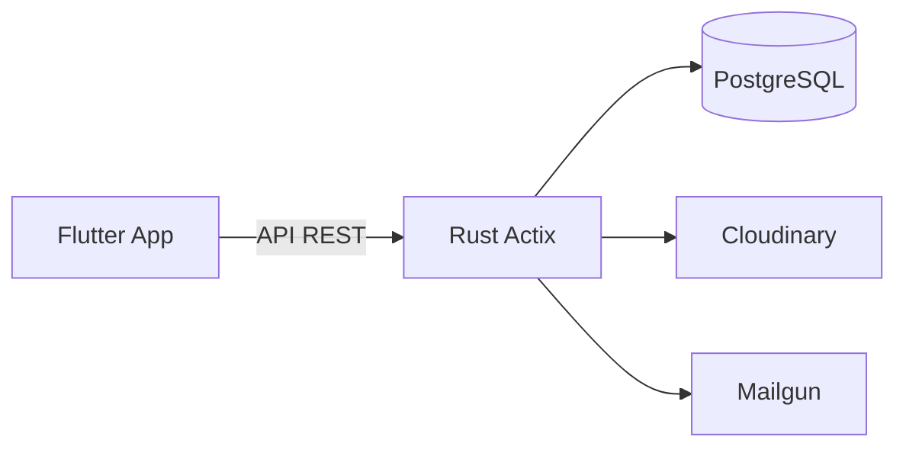

# Igreja Manager

Plataforma enterprise para administração de igrejas, com suporte multi-congregação, internacionalização completa (pt/en/es) e monetização via assinaturas.

## Stack Tecnológica

- **Backend**: Rust (Actix-Web 4.13 + SQLx 0.8)
- **Banco**: PostgreSQL 16
- **Frontend**: Flutter (Android, iOS, Web)
- **Infra**: Docker, Vercel (web), Cloudinary, Mailgun

## Principais Módulos

- Cadastro completo de membros, famílias e visitantes
- Controle financeiro (dízimos, ofertas, relatórios, plano de contas)
- Escola Bíblica Dominical (EBD) com frequência, lições e relatórios
- Gestão de Ministérios com líderes, eventos, instrumentos e permissões
- Academia Bíblica (gamificada, estilo Duolingo)
- Roles & Permissões granulares (multi-cargo, pastor, owner, etc.)
- Congregações, relatórios, auditoria e suporte a internacionalização

## Por que impressiona

Mais de 40 migrations, 30+ documentos de arquitetura e testes, RBAC avançado, testes extensivos e deploy com Docker + CI. Um dos sistemas de gestão eclesiástica mais completos em produção.

**Live**: [igreja.drumblow.com](https://igreja.drumblow.com)
