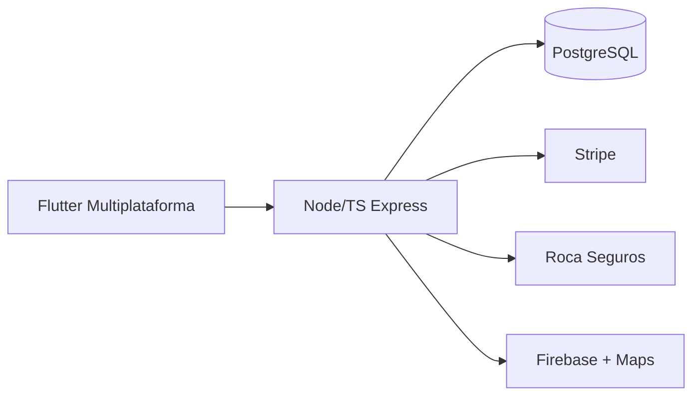

# Jumb

Plataforma marketplace que conecta turistas a experiências e guias locais, com suporte completo a turistas internacionais. Projeto de grande escala que demonstra capacidade em produtos complexos de alto volume.

## Stack e Escala

- **App**: Flutter full cross-platform (Android, iOS, Web, Windows, macOS, Linux)
- **Backend**: Node.js + TypeScript + Express + pg
- **Integrações**: Stripe (pagamentos com fees), Roca Seguros (fluxo completo de insurance), Firebase (FCM + Auth), Google Maps / Geocoding, Cloudinary

## Destaques

- ~96.000 linhas de código, 31 migrations, mais de 20 mil linhas de testes (Jest + Flutter)
- CI/CD, Docker, nginx, documentação extensa e guias de deploy
- Funcionalidades: atividades, bookings, providers, reviews, notifications, support tickets, KYC, pricing groups, admin

**Status**: Arquivado após desenvolvimento avançado e produção de documentação e testes de alta qualidade. Excelente referência de capacidade em marketplaces complexos.

