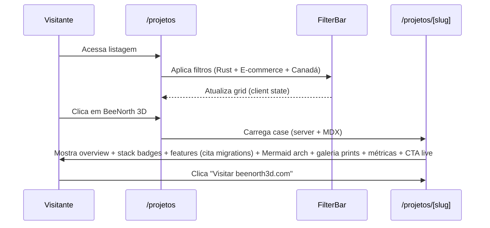

# Planejamento do Novo Website Profissional da Drumblow

**Autor:** Placeholder (Equipe Técnica / Arquiteto de Sistemas)  
**Data:** 02 de junho de 2026  
**Status:** Draft  
**Versão:** 1.0  

---

## Overview

O website atual da Drumblow (localizado em `../drumblow-website`) é um projeto Next.js 15 genérico e placeholder que não transmite o alto nível de profissionalismo, maturidade técnica e capacidade de entrega real da empresa. O site apresenta nome "Drumblow FabricApps", hero genérico ("Transformando ideias em soluções digitais"), casos de sucesso fictícios (ConnectCorp Hub), página de produtos com itens inventados e descrição de tecnologias desatualizadas na página Sobre (Next.js/TypeScript/Node.js/MongoDB).

A proposta é uma **renovação total** (reescrita completa) resultando em um website altamente profissional, clean, engineering-driven e baseado em evidências reais. O novo site posicionará a Drumblow como desenvolvedora especializada em:

- Backends de missão crítica em **Rust** (Actix-Web e Axum com SQLx, 13 a 40+ migrations por projeto, autenticação JWT/Argon2, RBAC granular).
- Aplicativos cross-platform **Flutter** enterprise (Android/iOS/Web/Desktop, BLoC, testes >10k linhas, integrações nativas).
- Frontends web modernos **Next.js** (App Router, TypeScript, Tailwind 4, com integrações complexas de pagamento e logística).

O núcleo do site será um **showcase profundo** dos projetos reais desenvolvidos:

1. **Igreja Manager** (`igreja.drumblow.com` — ativo): ERP eclesiástico completo (Rust Actix-Web + PostgreSQL + Flutter i18n pt/en/es, 40 migrations, Bible Academy gamificada estilo Duolingo, Stripe subscriptions, RBAC multi-cargo, Cloudinary, Mailgun).
2. **Drumblow Invoice** (`invoice.drumblow.com` — ativo): SaaS de faturamento profissional para negócios canadenses (Flutter cross + Rust Axum backend, 13 migrations incluindo monotonic counters, Stripe, tax calc para todas as províncias, Google Play, pentest completo, offline+cloud freemium).
3. **BeeNorth 3D** (`beenorth3d.com` — ativo): E-commerce premium de produtos 3D-printed personalizados (Next.js 16 + Rust Axum no Oracle ARM, 25 migrations, Stripe Payment Intents + Canada Post rates/labels/tracking completos, coupons, blog, admin, CI/CD GitHub Actions com cross-compile).
4. **Jumb** (avançado, arquivado): Marketplace de turismo/experiências (Flutter full cross-platform + Node/TS Express, ~96k LOC, 24 migrations (análise Fev/2026; 31 arquivos SQL atuais em migrations/), Stripe com manual capture + fees, integração Roca Seguros, Firebase FCM, Cloudinary, Google Maps, KYC verification, admin completo, testes extensivos).

O resultado será um site que **prova** a capacidade técnica em vez de apenas afirmar, com design system refinado (baseado em `#0F172A` slate, `#3B82F6` azul e `#F59E0B`/`#F5C542` âmbar/honey), case studies acionáveis, filtros por stack/domínio/país, galeria de screenshots, diagramas Mermaid, métricas reais extraídas do código-fonte e CTAs claros para contato/orçamento. O blog existente (MDX via loader gray-matter + unified) será mantido e melhorado (incluindo adição de detail page dedicada se ausente atualmente); a integração Telegram (bot API HTTP + webhook via rotas /api/telegram/* e TelegramClient em src/lib/telegram/client.ts — startSession/sendTelegramMessage) será reaproveitada no contato. (Nota: ws é dependência listada mas não utilizada no client Telegram atual; GramJS PDFs na raiz não são importados em src/.)

---

## Background & Motivation

### Estado Atual do Website (`../drumblow-website`)

Análise completa via leitura de arquivos-chave:

- **`src/app/layout.tsx`**: Fonts Inter + Source_Sans_3 + JetBrains_Mono + Geist (inconsistência). Metadata "Drumblow FabricApps". Usa Header/Footer simples + AnalyticsProvider.
- **`src/app/page.tsx`**: Hero com 3 cards de "Casos de Sucesso" 100% fictícios (ConnectCorp Hub, "Redução de 60%...", "Transformação Digital"). CTAs para `/products` e `/contact`.
- **`src/app/about/page.tsx`**: História genérica + valores genéricos + tech stack obsoleta: `["Next.js", "TypeScript", "Node.js", "MongoDB"]`.
- **`src/components/layouts/header.tsx`**: Logo "Drumblow", links Produtos / Sobre Nós / Blog / Contato (botão).
- **`src/components/layouts/footer.tsx`**: "Drumblow FabricApps", links para produtos fictícios como `/products/connectcorp-hub`.
- **`src/app/products/page.tsx`**: Apenas ConnectCorp Hub (fictício) + "Soluções Customizadas".
- **`src/app/contact/page.tsx`**: Formulário funcional que usa `TelegramClient` + `<TelegramChat />`. Bom ponto de partida.
- Blog: `content/posts/teste.mdx` (e 3 outros "teste"), `src/lib/blog/mdx.ts` (gray-matter + remark), admin CRUD em `/admin/blog`, search client-side.
- Stack (package.json): Next 15.0.3, Tailwind 3.4.15, Radix, lucide-react, next-intl (instalado mas 0 usos em src/), next-mdx-remote (instalado mas não usado em src/ — blog usa custom unified+remark-html), marked, Cloudinary, ws (listado mas não usado no Telegram client), security custom (rate limit, sanitize, headers), Jest + Testing Library. Blog detail rendering atualmente ausente ou incompleto (páginas blog/page.tsx e blog/[slug]/page.tsx implementam listagem + search client-side via /api/blog; loader produz HTML mas consumo é via API).
- Design: Container shadcn-like, cores custom Tailwind (primary `#0F172A`, secondary `#3B82F6`, accent `#F59E0B`), globals.css com HSL vars básicas.
- Segurança/Infra: `src/lib/security/*` (rateLimit.ts, headers.ts com CSP, sanitize.ts), middleware.ts, api/telegram/* (webhook, setup, test), analytics (gtag + hotjar + custom events).

**Pontos fracos críticos** (confirmados por inspeção):
- Zero menção aos projetos reais avançados (nenhum link para beenorth3d.com, invoice.drumblow.com ou igreja.drumblow.com).
- Sem portfólio real → sem prova social de capacidade técnica.
- Não reflete stack real da Drumblow (Rust para backends críticos, Flutter enterprise cross-platform, integrações Canadá Post/Stripe/insurance/Roca Seguros, SaaS monetizado, RBAC, auditoria, 96k LOC em Jumb, 40+ migrations, testes >20k linhas, CI/CD, pentests, self-hosting mail).
- Branding inconsistente ("FabricApps" nunca aparece nos projetos reais).
- Design básico sem impacto visual forte ou elementos que comuniquem "engenharia de produção".

### Projetos Reais a Showcasear (Análise Detalhada)

Exploração via `list_dir`, `read_file` e `grep` nos diretórios `../igreja`, `../Invoice`, `../newbeenorth3d`, `../TRAE/jumb` e `../TRAE/jumb-mail`.

**1. Igreja Manager (`igreja.drumblow.com` — ativo)**  
- **Stack**: Rust (Actix-Web 4.13 + SQLx 0.8 + PostgreSQL 16 + Redis cache + JWT + Argon2 + Utoipa), Flutter 3.41 (BLoC 9, Go Router 17, Dio/Retrofit, Reactive Forms), i18n completo (backend `src/locales/{pt,es,en}.yml`, frontend ARB + scripts de sync em `frontend/scripts/`), Cloudinary, Mailgun, Stripe (subscriptions + webhooks HMAC), Cloudflare Turnstile.  
- **Escala/Complexidade**: `backend/migrations/` → 40 arquivos .sql (ex: `20260601000000_academia_biblica.sql`). `docs/` → 30+ arquivos de arquitetura, requisitos, testes, roles (ex: `28-modulo-academia-biblica-duolingo.md`, `17-padrao-roles-multi-cargo.md`, `ANALISE_ROLES_E_PERMISSOES.md`, `24-plano-testes-cobertura-total.md`). ~30+ módulos (membros/famílias, financeiro/dízimos, patrimônio, EBD, ministérios com leaders/eventos/instrumentos, Academia Bíblica gamificada Duolingo-style com streaks/hearts/ranking, relatórios granulares, multi-congregações, subscriptions/monetização, auditoria). RBAC com wildcards (`members:*`), scopes (global/congregation/self), multi-cargo. Deploy: Docker + Oracle + Vercel (vercel.json com rewrites + headers).  
- **Por que impressiona**: Enterprise-grade real em produção. Internacionalizado, monetizado, com compliance implícito para igrejas, documentação de excelência, testes contrato + integração.  
- **Citações chave**: `AGENTS.md` (stack detalhada, arquitetura em camadas domain/application/api/infra), `backend/src/api/middleware.rs` (auth + RBAC), `frontend/lib/features/` (736+ arquivos Dart).

**2. Drumblow Invoice (`invoice.drumblow.com` — ativo)**  
- **Stack**: Flutter (mobile + web + desktop layout plans) + Rust (Axum 0.8 + Tokio + SQLx 0.8 Postgres + jsonwebtoken + argon2 + reqwest + hmac para Stripe).  
- **Escala/Complexidade**: `drumblow-api/migrations/` → 13 arquivos (ex: `012_monotonic_invoice_counter.sql` para prevenir bypass de limites por delete/create; `013_refresh_tokens_and_rate_limiting.sql`). Features: clientes/categorias/jobs, invoices com counter monotonic, Stripe, Google Play in-app purchases + OAuth, freemium/trial/magic link, sync, rate limiting, printing, Google sign-in, account deletion (com privacidade), plan changes. Pentest (125 testes: `pentesteanalise/PENTEST_EXECUTION_REPORT.md` + `PENTEST_RESULTS*.json`), SECURITY_AUDIT.md, DATA_SAFETY_DECLARATION.md, PLAY_STORE_LISTING.md, assets/prints/.  
- **Por que impressiona**: SaaS completo monetizado cross-platform em produção focado em negócios canadenses (tax calc GST/HST/PST/QST para 13 províncias). Auditorias de segurança reais + fixes.  
- **Citações chave**: `drumblow-api/Cargo.toml`, `drumblow_invoice/PLAY_STORE_LISTING.md` ("BUILT FOR CANADA", "Offline or cloud-synced"), `docs/SECURITY_AUDIT.md` (21 vulns, todas CRITICAL/HIGH tratadas).

**3. BeeNorth 3D (`beenorth3d.com` — ativo)**  
- **Stack**: Frontend Next.js 16 (App Router, TS, Tailwind 4) no Vercel + Backend Rust (Axum 0.8 + SQLx) no Oracle ARM Free Tier + PostgreSQL 16 + Stripe Payment Intents + Canada Post (rates + labels completos via `src/canada_post/`) + coupons + blog + newsletter + analytics + auth + admin.  
- **Escala/Complexidade**: `backend/migrations/` → 25 arquivos (ex: `20260410000002_create_shipments_table.sql`, `20260423094000_create_filament_colors.sql`, `20260430000001_add_quantity_discounts.sql`, `20260427000002_add_order_public_token.sql`). Features: products com dimensões/filament colors/qty discounts, shipments, orders, public tokens, reviews, contact, instagram integration, full CI/CD GitHub Actions (cross compile ARM, deploy), backups cron, health `/health`, Docker, nginx. Assets com logos profissionais (`assets/logo*.png`). Design system próprio (globals.css: `--color-honey: #F5C542`, `--color-cream: #FFF8F0`, `--color-charcoal: #2D2D2D`, display Cormorant Garamond + Outfit).  
- **Por que impressiona**: E-commerce full custom de alto nível com logística integrada real (labels de envio Canada Post gerados). Produção com CI/CD confiável, backups, healthchecks.  
- **Citações chave**: `README.md` (tabela de arquitetura, comandos de deploy, Canada Post config), `frontend/src/app/globals.css`, `frontend/src/app/page.tsx` (fetch products + InstagramReels + reviews), componentes testados (HoneycombGrid, ProductCard etc).

**4. Jumb + Jumb Mail (TRAE/jumb e jumb-mail — Jumb arquivado, infra ativa)**  
- **Jumb Stack**: Flutter (Android/iOS/Web/Windows/macOS/Linux — full cross) + Node.js/TS + Express 5 + PostgreSQL 15 + Stripe (Payment Intents com capture manual + idempotency + fees 10%/12%) + Firebase (FCM + Auth) + Cloudinary + Google Maps/geocoding + Roca Seguros (insurance integration completa: classificação risco, apólices, sinistros, R$5/participante).  
- **Escala/Complexidade**: ~96k+ LOC (backend ~23.2k TS, frontend ~48.5k Dart), 24 migrations (~1.8k linhas SQL conforme análise de Fev/2026 em Analise_detalhada_projeto_Jumb.md; filesystem atual tem 31 arquivos .sql em migrations/ — nota de drift entre análise e repo atual; usar "24-31" em frontmatter com explicação). Testes backend Jest ~10.9k linhas (48 arquivos), testes Flutter ~10k+ linhas. Controllers/services extensos (bookings, payments, insurance, chat, verification, support tickets, notifications, admin 39 endpoints). CI/CD GitHub, Docker, nginx. Docs detalhados (`Analise_detalhada_projeto_Jumb.md`, CI_CD_GUIDE.md, múltiplos flows de pagamento/atividade).  
- **Jumb Mail**: Infra self-hosted completa (Stalwart Mail Server Rust no Oracle 163.176.215.141, Roundcube, nginx, SMTP/IMAP/POP3/Sieve, TLS Let's Encrypt, DKIM/SPF/DMARC, admin panel em 8080). Domínio `jumb.com.br` / `mail.jumb.com.br`. Scripts e configs detalhados.  
- **Por que impressiona**: Demonstra capacidade em produtos de alto volume/regulados (marketplace turismo com seguro obrigatório), DevOps/infra confiável (self-host mail enterprise), escala de testes e documentação.  
- **Citações chave**: `../TRAE/jumb/Analise_detalhada_projeto_Jumb.md` (métricas exatas, arquitetura, Roca Seguros 322 linhas de testes), `../TRAE/jumb-mail/README.md` (portas, DNS, Stalwart config).

### Consistência Técnica da Drumblow (Insights)

- Preferência clara por **Rust** em backends de produção (performance, segurança de memória, tipagem forte, Axum/Actix).
- **Flutter** como escolha principal para apps cross-platform de qualidade nativa com uma única codebase (incluindo desktop no Jumb).
- **Next.js** para frontends web modernos e e-commerces (BeeNorth demonstra uso atualizado).
- Foco obsessivo em produção: testes extensivos, CI/CD GitHub Actions, Docker, Oracle Cloud + Vercel, segurança (audits/pentests/rate limits/sanitização/headers), monetização real (Stripe, subs, freemium, in-app), integrações 3rd-party complexas (Canada Post labels, Roca Seguros, Google Play), i18n, documentação excelente (30+ docs por projeto).
- Projetos canadenses (Invoice, BeeNorth — foco CA, Canada Post) e brasileiros (Igreja, Jumb).
- Branding atual fraco/inconsistente. Logos e prints existem em `newbeenorth3d/assets/`, `Invoice/drumblow_invoice/assets/prints/`, `TRAE/jumb/imgs/` etc.

O website atual é o maior gap de percepção entre o que a Drumblow **entrega** e o que o mercado **vê**.

---

## Goals & Non-Goals

### Goals Explícitos

- Criar um website que **reflita** o profissionalismo real: engineering aesthetic (clean, confiável, técnico mas acessível), sem genéricos de agência.
- **Showcase forte e profundo** dos 4 projetos como "Trabalhos Realizados" com case studies de verdade (não cards superficiais): stacks exatas, features concretas citando paths de código/migrations/docs, métricas quantificadas, links live onde aplicável (beenorth3d.com, invoice.drumblow.com, igreja.drumblow.com), screenshots/galerias.
- Design system profissional refinado a partir das cores atuais + elementos dos projetos (honey/cream de BeeNorth).
- SEO forte, performance (LCP otimizado, imagens), acessibilidade (WCAG), mobile-first, fast (Next 16 + static onde possível).
- Fácil de manter: cases via MDX/frontmatter (similar ao blog atual em `src/lib/blog/mdx.ts`), adição de novo projeto = novo arquivo .mdx + atualização de loader.
- CTAs claros e múltiplos para contato/orçamento (form + Telegram + links diretos).
- Manter/reaproveitar e melhorar: blog (MDX + search), Telegram chat/integration (contato), security libs existentes, analytics patterns, OptimizedImage.
- Opcional: i18n (pt-BR principal; EN para hero/cases canadenses/sobre para atrair mercado CA).
- Posicionar stack real: Rust para backends, Flutter cross, Next.js web, com foco em testes, CI/CD, integrações e produção.

### Non-Goals (Fronteiras de Escopo)

- Não recriar ou hospedar os sites dos projetos (apenas links + resumos profundos).
- Não usar placeholders, casos fictícios ou métricas inventadas nunca mais (todos os dados extraídos de código real: 40 migrations, 25 migrations, 13 migrations, 96k LOC, etc.).
- Não manter página /products atual com itens fictícios (substituída por /projetos).
- Não remover funcionalidades úteis existentes sem substituto melhor (Telegram é mantido).
- Não priorizar "belas artes" ou heavy illustrations se não agregarem prova técnica (foco em screenshots reais + diagramas Mermaid).
- Não fazer rewrite em outra stack (manter Next.js por consistência com BeeNorth e site atual).
- Não incluir time/fotos de pessoas a menos que fornecidas (foco em trabalho e processo).

---

## Proposed Design

### Arquitetura de Informação / Sitemap

```mermaid
graph TD
    A[Home /] --> B[Projetos /projetos]
    A --> C[Sobre /sobre]
    A --> D[Blog /blog]
    A --> E[Contato /contato]
    B --> F[Projeto Detail /projetos/[slug]]
    D --> G[Post /blog/[slug]]
    F --> H[Live Link Externo<br/>igreja.drumblow.com etc]
    E --> I[Formulário + TelegramChat<br/>reaproveitado]
    B --> J[Filtros Client: Stack<br/>Rust/Flutter/Next<br/>Domínio / País]
    C --> K[Stack Philosophy<br/>+ Métricas Reais]
```

**Fluxo de Usuário Típico para Showcase:**



### Princípios de Design Visual + Sistema de Design

**Paleta Refinada (estender `tailwind.config.ts` e `globals.css` atuais)**:

- Primary / Slate escuro: `#0F172A` (mantido, engineering).
- Accent Blue (confiança/links/CTAs): `#3B82F6` ou `#2563EB`.
- Accent Honey/Amber (destaque, energia dos projetos 3D): `#F59E0B` + `#F5C542` (direto de `newbeenorth3d/frontend/src/app/globals.css`).
- Neutrals: stone/zinc para cards e separadores (mais premium que gray puro).
- Suporte light mode mínimo (default dark-lean para profissionalismo de software).

**Tipografia**:
- Body: Inter (atual) + Source Sans 3.
- Code/Metrics: JetBrains Mono (atual).
- Display (headings hero/cases): Manter sans ou adicionar Cormorant Garamond / Outfit leve (inspirado BeeNorth) via next/font.
- Tamanhos e tracking apertados para aspecto técnico.

**Componentes e Padrões de Showcase** (com interfaces Props + pseudocódigo para especificidade):
- Cards de projeto: imagem principal (screenshot web ou logo), title + tagline curta, badges de stack (cores: Rust=ferrugem, Flutter=azul céu, Next=preto, Node=verde), domínio/país, métricas inline (ex: "25 migrations • Stripe + Canada Post"), status badge (Ativo / Arquivado).
- Página de case: seções fixas (Visão Geral, Stack Tecnológica com versões, Destaques de Funcionalidades — bullets concretos citando paths, Arquitetura — Mermaid, Integrações 3rd-party, Métricas de Complexidade, Screenshots/Galeria, Links e CTAs).
- Reaproveitar/extender: `Button` atual, `OptimizedImage`, adicionar `ProjectCard`, `FilterBar` (chips multi-select + search + URL sync), `TechBadge`, `MetricsGrid`, `ScreenshotGallery` (grid responsivo + modal ou carousel leve).
- Animações sutis (framer-motion, adicionado no PR1a): hover lift em cards, fade em filters (não excessivo).
- Espaçamento amplo, containers max 1280-1400px, mobile-first (stack vertical em cards).

**Interfaces e pseudocódigo de componentes chave** (para evitar ambiguidade em PR3/4/7):

```tsx
// src/lib/projetos/types.ts
export interface ProjectMeta {
  slug: string; // derivado do filename .mdx (não redundante no frontmatter)
  title: string;
  tagline: string;
  status: 'ativo' | 'arquivado';
  liveUrl?: string;
  stacks: string[]; // ex: ["Rust", "Axum", "Flutter", "PostgreSQL", "Stripe"]
  domains: string[]; // ex: ["E-commerce", "SaaS Financeiro"]
  country: string; // "Canadá" | "Brasil / Internacional (pt/en/es)"
  metrics: { migrations?: number; loc?: string; features?: number; /* ... */ };
}

export interface ProjectContent { meta: ProjectMeta; mdxSource: any; } // from serialize

// src/components/projetos/ProjectCard.tsx
interface ProjectCardProps { project: ProjectMeta; }
export function ProjectCard({ project }: ProjectCardProps) { /* render logo/screenshot, badges, metrics, link to /projetos/${slug} */ }

// src/components/projetos/FilterBar.tsx (decidido: URL searchParams sync)
interface FilterBarProps {
  availableStacks: string[];
  availableDomains: string[];
  selected: { stacks: string[]; domains: string[]; country?: string; query: string };
  onChange: (next: FilterBarProps['selected']) => void;
}
export function FilterBar(props: FilterBarProps) {
  // usa useSearchParams / router para sync (shareable links); multi-select chips; search input
  // valores reais vindos dos 4 frontmatters (ver template abaixo)
}

// src/components/projetos/ScreenshotGallery.tsx (ver playbook para specs completas)
interface ScreenshotGalleryProps {
  images: Array<{src: string; alt: string; caption?: string; type?: 'web'|'mobile'|'desktop'}>;
  columns?: 2 | 3;
}
export function ScreenshotGallery({ images, columns = 2 }: ScreenshotGalleryProps) { /* grid + dialog lightbox com keyboard nav, aria */ }

// TechBadge, MetricsGrid similares (simples, com variants por stack).
```

**Exemplo de FilterBar atualizado com valores reais dos cases** (consts derivadas dos frontmatters):

```tsx
const STACKS = ['Rust', 'Actix-Web', 'Axum', 'Flutter', 'Dart', 'PostgreSQL', 'Next.js', 'TypeScript', 'Node.js', 'Express', 'Stripe', 'Canada Post', 'Firebase', 'Cloudinary'] as const;
const DOMAINS = ['ERP Vertical / Gestão Eclesiástica', 'SaaS de Faturamento', 'E-commerce de Produtos 3D', 'Marketplace de Turismo'] as const;
const COUNTRIES = ['Canadá', 'Brasil / Internacional (pt/en/es)'] as const;
// ...
```

- Decisão: URL searchParams sync (recomendado e implementado) para links compartilháveis de filtros. Zod no loader para validar frontmatter em build/dev.

### Estratégia de Conteúdo


### Estratégia de Conteúdo

**Template para Case Studies (content/projetos/[slug].mdx)**:

Frontmatter obrigatório para filtros e cards (slug **derivado do filename** como no blog atual — remova campo redundante "slug" do frontmatter; loader usa nome do arquivo .mdx). 4 exemplos **completos com valores reais** extraídos de exploração (stacks/domínios/country/métricas exatas dos projetos; use estes como base para os MDX em PR2/4):

```mdx
---
title: "Igreja Manager"
tagline: "ERP completo de gestão eclesiástica para igrejas de todos os portes (SaaS internacionalizado)"
status: "ativo"
liveUrl: "https://igreja.drumblow.com"
stacks: ["Rust", "Actix-Web", "SQLx", "PostgreSQL", "Flutter", "Dart", "BLoC", "Go Router"]
domains: ["ERP Vertical / Gestão Eclesiástica", "SaaS"]
country: "Brasil / Internacional (pt/en/es)"
metrics:
  migrations: 40
  modules: 8
  i18n: 3
  tests: "contrato + integração extensivo"
---

# Visão Geral
... (copiar/adaptar de README + AGENTS + docs/28 e 17)
## Stack Tecnológica
... (tabela com versões de AGENTS.md)
## Destaques...
- 40 migrations em `backend/migrations/` (ex: `20260601000000_academia_biblica.sql`, `202603*` para roles/ministries).
...
## Arquitetura
```mermaid
... (arch em camadas domain/application/api/infra)
```
...
## Links
- Site ao vivo: [igreja.drumblow.com](https://igreja.drumblow.com)
```

```mdx
---
title: "Drumblow Invoice"
tagline: "App profissional de emissão de invoices, orçamentos e gestão financeira para negócios canadenses"
status: "ativo"
liveUrl: "https://invoice.drumblow.com"
stacks: ["Flutter", "Rust", "Axum", "SQLx", "PostgreSQL", "Tokio", "Stripe", "jsonwebtoken"]
domains: ["SaaS de Faturamento", "Fintech / Produtividade"]
country: "Canadá"
metrics:
  migrations: 13
  features: "monotonic counters, freemium, offline+sync, tax CA 13 províncias"
  security: "pentest 125 testes + audit completo"
  tests: "extensivo (unit + integration)"
---

# Visão Geral
... (de PLAY_STORE_LISTING + SECURITY_AUDIT)
## Stack...
## Destaques
- 13 migrations em `drumblow-api/migrations/` (ex: `012_monotonic_invoice_counter.sql` para compliance de limites).
- Integração Stripe + Google Play in-app + OAuth + magic link.
- Cálculo automático de GST/HST/PST/QST para todas as províncias/territórios.
...
## Links
- Site ao vivo: [invoice.drumblow.com](https://invoice.drumblow.com)
- Play Store listing e privacy no repo.
```

```mdx
---
title: "BeeNorth 3D"
tagline: "E-commerce de produtos 3D-printed personalizados para home decor, business e party (Sarnia, Ontario)"
status: "ativo"
liveUrl: "https://beenorth3d.com"
stacks: ["Next.js", "TypeScript", "Tailwind 4", "Rust", "Axum", "SQLx", "PostgreSQL", "Stripe", "Canada Post API"]
domains: ["E-commerce de Produtos 3D Personalizados", "Logística Integrada"]
country: "Canadá (Sarnia, Ontario)"
metrics:
  migrations: 25
  integrations: "Stripe Payment Intents + Canada Post rates/labels/tracking completos"
  ci: "GitHub Actions cross-compile ARM para Oracle"
  health: "/health + backups cron"
---

# Visão Geral
... (de README)
## Stack...
## Destaques
- 25 migrations (ex: `20260410000002_create_shipments_table.sql`, `20260423094000_create_filament_colors.sql`, quantity discounts).
- Design system próprio (globals.css: --color-honey #F5C542, --color-cream, --color-charcoal).
...
## Links
- Site ao vivo: [beenorth3d.com](https://beenorth3d.com)
- API: ipa.beenorth3d.com
```

```mdx
---
title: "Jumb"
tagline: "Plataforma marketplace de turismo/experiências conectando turistas (BR + internacionais) a guias e atividades locais"
status: "arquivado"
liveUrl: ""  # (sem live público atual; mencionar docs/imgs no repo)
stacks: ["Flutter", "Dart", "Node.js", "TypeScript", "Express", "PostgreSQL", "Stripe", "Firebase (FCM/Auth)", "Cloudinary", "Roca Seguros API"]
domains: ["Marketplace de Turismo e Experiências", "Regulado / Seguros"]
country: "Brasil (com suporte internacional)"
metrics:
  migrations: "24 (análise Fev/2026; 31 arquivos SQL em migrations/ atualmente — drift repo)"
  loc: "~96k+ (23k backend TS + 48k Flutter Dart)"
  tests: ">10k linhas Jest backend + >10k Flutter (unit/widget/integration)"
  features: "Stripe manual capture + fees, Roca Seguros full (classificação risco, apólices), KYC verification, admin 39 endpoints, Google Maps"
---

# Visão Geral
... (de Analise_detalhada_projeto_Jumb.md)
## Stack...
## Destaques
- Integração completa Roca Seguros (322 linhas testes em src/services/__tests__/insurance.spec.ts).
- Pagamentos sofisticados com idempotency, anti-fraude server-side, reembolsos automáticos.
- Flutter full cross (incl desktop Windows/macOS/Linux).
...
## Nota
Desenvolvimento avançado completo (~96k LOC, CI/CD, Docker, extensos testes); projeto atualmente arquivado para foco em outros produtos. Demonstra capacidade em escala e domínio regulado.
## Links / Assets
- Imagens UI e website/ folder (com vídeos) em TRAE/jumb/imgs/ e website/.
- Análise técnica completa: Analise_detalhada_projeto_Jumb.md
```

**Copy sugerido para seções chave** (pt-BR profissional):

- **Hero**: "Drumblow. Software de produção para problemas reais.<br/>Backends Rust. Apps Flutter cross-platform. Plataformas web com integrações de pagamento e logística."
- **Sobre**: "Construímos sistemas que rodam em produção real. Nossos projetos incluem ERPs verticais internacionalizados, SaaS canadenses com faturamento monetizado, e-commerces com logística completa (Canada Post labels) e marketplaces com integração de seguros. Stack preferida: Rust para APIs críticas, Flutter para uma codebase nativa em múltiplas plataformas, Next.js para experiências web modernas."
- Evitar: "transformando ideias", "soluções inovadoras". Usar: "implementado", "validado em produção com 40+ migrations", "auditado e com pentest".

**Estratégia de Renderização MDX para Cases (crítico para Mermaid e conteúdo rico)**: 

O loader atual do blog (`src/lib/blog/mdx.ts`) usa `unified` + `remark-parse` + `remark-html` para produzir string HTML (servido via API, consumido client-side em listagem). next-mdx-remote está no package.json mas **não é utilizado em src/**. Para cases ricos (tabelas, código, blocos ```mermaid``` de arquitetura), adotamos abordagem dedicada com **next-mdx-remote** (ativar o uso da dep já presente) + componentes custom:

- Loader de projetos (`src/lib/projetos/loader.ts`) usará `gray-matter` para frontmatter + `serialize` de 'next-mdx-remote/serialize' para produzir `mdxSource` compilado (com opções remark/rehype para tabelas, links etc.).
- Em `src/app/projetos/[slug]/page.tsx` (server component): `<MDXRemote compiledSource={mdxSource} components={mdxComponents} />`.
- `mdxComponents` (em `src/components/projetos/MdxComponents.tsx`): inclui overrides para código, tabelas, e especialmente **Mermaid client component**.
- Mermaid: instalar `mermaid` (adicione ao package.json). Componente client `'use client'` com `useEffect` + `mermaid.render` para hidratar blocos ```mermaid ... ``` em SVG interativo (ou estático se preferir build-time). Evita remark-mermaid complexo; mantém compat com server render do resto do MDX. CSP: permitir 'unsafe-inline' ou nonce para scripts de Mermaid se necessário, ou preferir render estático em build via script (fallback para imagem SVG gerada).
- Vantagem vs blog atual: cases são server-rendered com SEO completo + rich content; blog pode evoluir para unificar (ver Issue 6 abaixo).
- Exemplo de componente Mermaid (pseudocódigo):

```tsx
// src/components/projetos/Mermaid.tsx
'use client';
import { useEffect, useRef } from 'react';
import mermaid from 'mermaid';

export function Mermaid({ chart }: { chart: string }) {
  const ref = useRef<HTMLDivElement>(null);
  useEffect(() => {
    if (ref.current) {
      mermaid.initialize({ startOnLoad: false });
      mermaid.render('mermaid-' + Date.now(), chart).then(({ svg }) => {
        if (ref.current) ref.current.innerHTML = svg;
      });
    }
  }, [chart]);
  return <div ref={ref} className="mermaid-diagram my-4" />;
}
```

- No MDX case: use ```mermaid ... ``` e o componente mapeará language 'mermaid'.
- Dependência nova: "mermaid": "^10.9.0" (dev ou prod). Adicionar em PR de infra MDX (PR 2 (Loader + MDX + 2 Cases)).
- Testar 1-2 diagrams reais nos primeiros cases (ex: arch de Igreja e de BeeNorth shipping).

**Blog (manter e melhorar)**: Reaproveitar o loader mdx.ts (gray-matter + unified + tipos) como base/inspiração para projetos/loader.ts (mas projetos usarão next-mdx-remote + serialize para rich MDX). Esclarecimento: "manter" significa preservar o sistema de arquivos content/posts/*.mdx, gray-matter frontmatter, search client-side básico e admin CRUD existente em curto prazo. Melhorias em PR7: (a) adicionar/fixar página de detail dedicada para post individual (atualmente blog/[slug]/page.tsx e list implementam apenas listagem + search via fetch /api; detail real de conteúdo HTML está incompleto/ausente); (b) melhorar UI de cards/list (tags clicáveis que atualizam filtro, paginação se crescer); (c) opcionalmente unificar abordagem com cases (MDXRemote) para consistência server render. Adicionar subtask em PR7: "Implementar blog detail page server-rendered se não existir". Evitar dualidade total: cases priorizam rich server MDX; blog evolui gradualmente.

**Assets & Screenshots Playbook (detalhado para execução, Issue 7)**:

1. **Mapping exato origem -> destino** (copiar manual ou script em PR4/9; renomear para consistência):
   - newbeenorth3d/assets/LogobeeNorthTransparente.png → public/assets/logos/beenorth-logo-transparent.png
   - newbeenorth3d/assets/logoBeeNorthComfundo.jpeg → public/assets/logos/beenorth-logo-bg.jpeg
   - newbeenorth3d/assets/logoVersaoHorizontalTransparente.png → public/assets/logos/beenorth-logo-horizontal.png
   - newbeenorth3d/assets/iconeTransparente.png → public/assets/logos/beenorth-icon.png
   - Invoice/drumblow_invoice/assets/prints/ (todos 8: 1.png, drumblow_feature_graphic_1024x500.png, WhatsApp*.jpeg) → public/assets/cases/invoice/ (manter nomes ou prefixar invoice-)
   - Invoice/drumblow_invoice/web/prints/ (hero-composite.png, mobile-*.jpeg) → public/assets/cases/invoice/web/ e /mobile/
   - TRAE/jumb/imgs/ (*.jpg: Activity Details.jpg, Chat.jpg, Explore Activities Map.jpg, Registration & Login.jpg, User Profile.jpg) → public/assets/cases/jumb/ (renomear jumb-*.jpg)
   - igreja/frontend/web/favicon.png + android/.../mipmap-*/ic_launcher.png → public/assets/cases/igreja/ (igreja-favicon.png + icons/ ou usar web build screenshots)
   - Prioridade de curadoria: BeeNorth (logos limpos + web screenshots via dev) e Invoice (muitos prints mobile/web) primeiro; Jumb (5 jpgs de UI) e Igreja (ícones + capturas web do app em Vercel) segundo.

2. **Lista recomendada de screenshots por case** (mínimo 3-5 por projeto para galeria; priorizar high-res):
   - BeeNorth 3D: homepage hero, product customization form, cart/checkout, admin products list, Instagram reels section (usar prints existentes + 1-2 novas de beenorth3d.com).
   - Invoice: mobile invoice list/detail (dos mobile-*.jpeg), settings, feature graphic, web landing (hero-composite).
   - Jumb: 5 jpgs existentes (map, chat, registration, profile, activity) — usar como-is ou crop para consistência.
   - Igreja: screenshots web do app (login, membros, EBD, academia bíblica, relatórios) capturados de https://igreja.drumblow.com ou local; + launcher icons.

3. **Processo de captura de qualidade (para screenshots novos, 1-2 dias alocados em PR4)**:
   - Web (BeeNorth, Invoice web, Igreja web): rodar local (`npm run dev` ou `flutter run -d chrome`), DevTools → Responsive (iPhone/Android preset) ou full desktop 1440px, print limpo (sem dev UI), salvar 2x para retina.
   - Flutter mobile (Invoice, Igreja, Jumb): usar emulador Android/iOS ou `flutter build web` + Chrome mobile emulation; ou device físico + scrcpy/screenshot. Evitar WhatsApp compress (usar originais).
   - 3D/Produto (BeeNorth): capturar customização com cores de filamento, dimensões, discounts.
   - Otimização: usar next/image (com sizes, quality 80, placeholder blur) para web; para prints legados com nomes ruins, usar unoptimized se necessário. Converter jpeg grandes para webp via sharp se build.
   - A11y/SEO: sempre alt text descritivo ("Screenshot da tela de faturas no app Drumblow Invoice para Android mostrando lista de invoices com totais em CAD").

4. **Specs do ScreenshotGallery** (componente reutilizável):
   ```tsx
   interface ScreenshotGalleryProps {
     images: Array<{ src: string; alt: string; caption?: string; type?: 'web' | 'mobile' | 'desktop' }>;
     columns?: number; // default 2-3 responsive
   }
   // Grid responsivo com <OptimizedImage />, lightbox via native <dialog> ou simples state modal (keyboard Esc/Arrow, aria-labelledby). Fallback: se erro load, mostrar placeholder com link.
   ```
   Usar em case MDX via custom component <ScreenshotGallery images={...} /> ou shortcode mapeado.

5. **Curadoria movida para PR4** (junto com loader + primeiros 2 cases) para ter previews com dados reais + imagens cedo. Risco alto mitigado com este playbook + assets já existentes em 3 projetos.

**Assets**: Seguir playbook acima. Usar `OptimizedImage` existente de src/components/ui/OptimizedImage.tsx (com sharp). Adicionar suporte a imagens locais em public/assets/cases/* + logos.

**Copy sugerido...** (mantido, com nota de seções EN em fase 2).

---

## API / Interface Changes

- **Sem breaking changes em APIs existentes** (reaproveitar `/api/telegram/*`, `/api/analytics/*`, blog routes).
- Novos routes Next.js App Router (server components onde possível para SEO):
  - `src/app/projetos/page.tsx` (client filters + grid).
  - `src/app/projetos/[slug]/page.tsx` (async, carrega MDX via loader + generateStaticParams).
  - `src/app/sobre/page.tsx`.
  - Atualizar `src/app/layout.tsx` (metadata por rota via generateMetadata, JSON-LD Organization + Project).
- Componentes novos: `src/components/projetos/*`, `src/lib/projetos/loader.ts` (espelhando `src/lib/blog/mdx.ts` e `src/lib/blog/types.ts`).
- Form contato: manter lógica atual de `TelegramClient` em `src/lib/telegram/client.ts` (reaproveitar `startSession` + `sendTelegramMessage` via HTTP fetch para Bot API; setupWebhook). Nota: integração é puramente bot token + webhook HTTP (sem WS ativo no client).

Exemplo de loader de projetos (concreto, com suporte MDXRemote + serialize para rich content e Mermaid):

```ts
// src/lib/projetos/loader.ts (sugerido) — exemplo completo e compilável (baseado em padrões reais do projeto: src/lib/security/validation.ts usa `import { z } from 'zod'`, src/lib/blog/mdx.ts usa gray-matter + try/catch + return typed)
import fs from 'fs';
import path from 'path';
import matter from 'gray-matter';
import { serialize } from 'next-mdx-remote/serialize';
import { z } from 'zod';
import { ProjectMeta, ProjectContent } from './types';

const projetosDir = path.join(process.cwd(), 'content/projetos');

const ProjectFrontmatterSchema = z.object({
  title: z.string(),
  tagline: z.string(),
  status: z.enum(['ativo', 'arquivado']),
  liveUrl: z.string().optional(),
  stacks: z.array(z.string()),
  domains: z.array(z.string()),
  country: z.string(),
  metrics: z.object({
    migrations: z.number().optional(),
    // ... outros campos
  }).passthrough(),
  // ... outros campos do frontmatter
});

export async function getProject(slug: string): Promise<ProjectContent | null> {
  try {
    const fullPath = path.join(projetosDir, `${slug}.mdx`);
    if (!fs.existsSync(fullPath)) return null;

    const fileContents = fs.readFileSync(fullPath, 'utf8');
    const { data, content } = matter(fileContents);

    const parsedMeta = ProjectFrontmatterSchema.parse(data) as ProjectMeta; // valida + tipa
    // slug derivado do filename (não do frontmatter)
    const meta: ProjectMeta = { ...parsedMeta, slug };

    const mdxSource = await serialize(content, {
      // mdxOptions: { remarkPlugins: [...], rehypePlugins: [...] } para tabelas/Mermaid etc.
    });

    return { meta, mdxSource };
  } catch (error) {
    console.error(`Error getting project ${slug}:`, error);
    return null;
  }
}

export async function getAllProjects(): Promise<ProjectMeta[]> {
  if (!fs.existsSync(projetosDir)) return [];
  const files = fs.readdirSync(projetosDir);
  const metas: ProjectMeta[] = [];
  for (const file of files) {
    if (!file.endsWith('.mdx')) continue;
    const slug = file.replace(/\.mdx$/, '');
    const proj = await getProject(slug);
    if (proj) metas.push(proj.meta);
  }
  return metas;
}
``` 
(Exemplo simplificado para o doc; zod já é dep do projeto. Em PR2, expandir com error handling, cache, etc. e testar contra os 4 frontmatters reais.)
(Ver seção de renderização MDX acima para details de integração com componentes custom Mermaid.)

---

## Data Model Changes

- **Novo diretório**: `content/projetos/` (paralelo a `content/posts/` e `content/authors/`).
- Schema via frontmatter (zod validável no loader para segurança):
  - Campos para filtros e cards (stacks, domains, country, status, metrics como objeto).
  - Sem migração de DB (site é conteúdo estático + client state).
- Blog: manter schema atual; opcionalmente unificar loader.
- Analytics: estender `src/lib/analytics/customEvents.ts` com eventos de filtro/case-view (ex: `project_filter_applied`, `case_study_viewed`).

Estratégia de migração de conteúdo: 1) Copiar posts existentes. 2) Criar 4 arquivos .mdx de cases com dados reais. 3) Remover conteúdo fictício de pages antigas.

---

## Alternatives Considered

1. **Adicionar seção de portfólio ao site atual (incremental, sem reescrita)**  
   Prós: Entrega rápida (poucos PRs), risco baixo, preserva Telegram/blog/analytics existentes.  
   Contras: Design e copy genéricos permanecem; não resolve o gap de percepção ("FabricApps" vs Rust/Flutter real); cards superficiais não transmitem complexidade (40 migrations, Roca Seguros, Canada Post labels); navegação atual (Produtos/Sobre) não casa com showcase profundo.  
   **Trade-off**: Velocidade vs. impacto. Rejeitado — não cumpre "altamente profissional que reflita o verdadeiro profissionalismo e capacidade técnica".

2. **Webflow / Framer / template visual premium + embed**  
   Prós: Tempo de design visual curto, animações bonitas prontas, fácil para não-devs.  
   Contras: Perde todo o ecossistema Next (MDX blog existente, security libs `src/lib/security/*`, Telegram client, Jest tests, CI patterns do projeto); difícil ou impossível renderizar Mermaid + código técnico + frontmatter filtrável; não demonstra a capacidade de engenharia da empresa (contraste doloroso com a qualidade dos projetos Rust/Flutter/Next); SEO/customizações e manutenção de conteúdo mais difíceis; custo recorrente.  
   **Trade-off**: Aparência rápida vs. autenticidade e controle. Rejeitado.

3. **Reescrita completa em Next.js (esta proposta)**  
   Prós: Consistência com BeeNorth (Next 16 + Tailwind 4) e site atual; reaproveitamento maciço de código (security, chat, blog mdx, analytics, button, OptimizedImage); permite cases MDX com dados estruturados para filtros poderosos; demonstra expertise em stack moderna; deploy simples Vercel; performance e SEO nativos; fácil adicionar páginas estáticas com generateStaticParams.  
   Contras: Esforço maior (estimado 4-8 semanas em PRs incrementais).  
   **Trade-off**: Investimento inicial maior, mas ROI alto em percepção de marca e alinhamento com entregas reais. **Escolhido**.

4. **Astro + MDX ou outro SSG**  
   Prós: Mais leve, excelente para conteúdo estático.  
   Contras: Menor familiaridade do time (perde React patterns atuais), interatividade de filtros complexos exige mais JS, perda do admin blog atual e libs de segurança/Telegram integradas, ecossistema menor para futuras features.  
   Rejeitado em favor de continuidade.

5. **Híbrido conservador (alternativa adicional para reduzir risco inicial)**: Manter Next 15 + Tailwind 3 (evitar upgrade breaking grande em PR1), adicionar /projetos + 4 cases MDX em paralelo usando abordagem similar ao blog atual (loader gray-matter + HTML render via unified ou ativar next-mdx-remote sem migrar stack), redirects opcionais para paths novos, sem redesign visual completo ou tokens novos inicialmente. Depois de validar showcase (3-4 PRs), decidir upgrade full ou manter.  
   Prós: Entrega prova de conceito do portfólio real em 3-4 PRs com zero breaking no existente; preserva Telegram/security/blog/Jest 100%; permite validar ROI de "mostrar projetos reais" antes de investir em renovação total de design/upgrade. Previews mostram cases reais rápido.  
   Contras: Design tokens mistos permanecem temporariamente; não transmite "renovação total" e maturidade visual imediatamente (pode parecer incremental); ainda requer esforço de curadoria de conteúdo.  
   **Trade-off**: Velocidade de showcase + baixo risco vs. "altamente profissional" completo de uma vez. Considerada seriamente (especialmente dado dívida técnica no upgrade TW + Radix); rejeitada como principal porque o gap de percepção atual é grande (site genérico vs. qualidade Rust/Flutter/Next real) e um redesign parcial não elevaria a marca o suficiente para senior prospects/CA businesses. Manter reescrita completa como escolha, mas documentada para referência da equipe.

---

## Security & Privacy Considerations

**Threat Model**:
- Form de contato: spam, injection, abuso de rate. Mitigação: reaproveitar `src/lib/security/rateLimit.ts` + `sanitize.ts` + validação Zod (existente no projeto); adicionar honeypot ou Cloudflare Turnstile (como usado em Igreja `backend/src/`); forward apenas metadados para Telegram (sem log persistente de PII além do necessário).
- Assets e MDX: conteúdo estático → sem risco de execução. Usar gray-matter seguro (já em uso).
- CSP/headers: expandir `src/lib/security/headers.ts` e `generateCSP` para novo site (reaproveitar integralmente); incluir `img-src` para Cloudinary se usado + assets locais; strict referrer. Para Mermaid (client-side render): se usar scripts inline, permitir 'unsafe-inline' temporário ou usar abordagem de SVG estático gerado em build (recomendado para segurança; fallback imagem se mermaid falhar). Revisar no PR7.
- Links externos (lives): usar `rel="noopener noreferrer"` + target blank.
- i18n: sem impacto em segurança.
- Pentest mindset: aplicar mesma disciplina dos projetos (Invoice teve 125 testes de pentest + security audit; Igreja tem `SECURITY_ADVISORIES.md`).

**Privacy**:
- Adicionar `/privacidade` simples (reaproveitar estrutura de Invoice `drumblow_invoice/PRIVACY_POLICY.md`).
- Footer com links legais + ano.
- Analytics: manter patterns existentes; documentar o que é coletado (gtag etc).
- Telegram: webhook já existe e é testado (`src/app/api/telegram/webhook/route.ts` + testes). Manter autenticação e validação.

Risco explícito (severidade alta): Exposição de webhook Telegram. Mitigação: já implementada no projeto atual (rate limit + sanitize); revisar em rollout.

---

## Observability

- **Logging**: Reaproveitar patterns de `src/lib/telegram/` e middleware existentes. Adicionar console estruturado ou pino se expandir. Vercel logs nativos.
- **Metrics/Analytics**: Manter `src/components/analytics/AnalyticsProvider.tsx`, `src/lib/analytics/*` (gtag, hotjar, customEvents). Adicionar eventos específicos: `project_viewed`, `filter_changed`, `contact_form_submitted`, `live_link_clicked`. Opcional: Vercel Analytics + Speed Insights (leve).
- **Error Handling**: Manter `src/app/error.tsx` + `global-error.tsx`. Boundary em filtros client.
- **Alerting**: Leads de contato via Telegram (já funciona). Para prod: configurar alertas Vercel ou integrar com bot existente para erros críticos.

**Spec concreta de Health Check** (implementar em PR7 como /api/health route, espelhando BeeNorth `/health` + static content checks):
GET /api/health → 200
```json
{
  "status": "ok",
  "checks": {
    "content": "loaded",
    "mdx_cases": "4 loaded (igreja-manager, drumblow-invoice, beenorth-3d, jumb)",
    "blog_posts": "ok (published count)"
  },
  "version": "1.0",
  "projects": 4,
  "timestamp": "2026-..."
}
```
Sem DB (site estático). Incluir em monitoring e CI smoke.

**Exemplos de JSON-LD** (adicionar via <script type="application/ld+json"> em layout ou pages específicas, em PR7/8):
- Organization (global): {"@context":"https://schema.org", "@type":"Organization", "name":"Drumblow", "url":"https://drumblow.com", "logo": "...", "sameAs": ["https://github.com/Drumblow/..."] }
- Para /projetos: ItemList de SoftwareApplication ou CreativeWork com os 4 cases (name, description, url live, applicationCategory, operatingSystem etc). Usar generateMetadata + JsonLd component (similar a BeeNorth).
- **Saúde do site**: Adicionar rota simples `/api/health` (espelhando `/health` do BeeNorth backend) que verifica envs e responde rápido.
- **Rastreamento de performance**: Core Web Vitals via Vercel + custom para tempo de filtro/case load.

---

## Rollout Plan

**Abordagem**: Reescrita em branch `feat/new-professional-website`. Deploy preview automático no Vercel por branch. Estrutura base (upgrade + navegação) + MDX content core em paralelo desde PRs iniciais para que previews mostrem dados reais cedo (home teaser e grid usam cases reais a partir de PR3). UI polish e assets completos em paralelo.

**Fases** (alinhadas à ordem real do PR Plan abaixo):
1. **Preparação/Upgrade (PR 1a + PR 1b)**: Upgrade limpo Next + deps (framer-motion, mermaid), smoke tests; design tokens + nav/footer base + layout. Assets básicos importados conforme playbook.
2. **Conteúdo Core + Infra MDX (PR 2 (Loader + MDX + 2 Cases))**: Loader + render MDXRemote + componentes (incl Mermaid client) + 2 cases completos (Igreja + BeeNorth) com frontmatters reais, 1-2 diagrams Mermaid testados. Previews já mostram cases reais.
3. **Home + Listagem com Dados Reais (PR 3 (Home + List com dados reais))**: Home + /projetos grid + filtros usando loader real + ProjectCard. Previews têm dados + métricas reais desde aqui.
4. **Cases Restantes + Galeria + Assets (PR 4 (Cases Restantes + Gallery + Playbook))**: Invoice + Jumb MDX + ScreenshotGallery + curadoria inicial de prints (playbook executado). 
5. **Complementos (PR 5 (Sobre) - PR 6 (Blog + Contato))**: /sobre (com métricas agregadas), blog melhorado (incl fix detail se ausente) + contato polido.
6. **Polimento & QA (PR 7 (SEO/Health/robots))**: SEO (JSON-LD examples, sitemap, robots.txt, health spec), perf, a11y, testes.
7. **Assets Finais + Branding + Launch (PR 9 (Assets + branding final) - PR 10 (Launch))**: Curadoria final + polish copy + decisão branding/logo + redirects + deploy. Monitor 48h.
8. **Pós-launch**: Iterar; novos cases via PR de MDX simples.

**Feature Flags / Staged**:
- Para Jumb (arquivado): flag `SHOW_ARCHIVED_JUMB=true` no loader (default false em preview inicial; true para launch com badge "Arquivado").
- Rollback: Vercel instant previous deployment + revert commit. Backup de conteúdo MDX em git.

**Feature Flags / Staged**:
- Para Jumb (arquivado): flag simples em loader (`SHOW_ARCHIVED=true`) ou seção separada "Trabalhos Anteriores".
- Rollback: Vercel instant previous deployment + revert commit. Backup de conteúdo MDX em git.

**Estimativa**: 6-10 semanas em PRs incrementais realistas (dependendo de disponibilidade de screenshots de qualidade e copy final).

**Riscos Explícitos com Mitigações**:
- **Alto**: Tempo para screenshots de qualidade e curadoria de prints (projetos têm alguns em `assets/prints/`, `web/prints/`, `imgs/`, mas não uniformes). Mitigação: priorizar cases com mais assets (BeeNorth + Invoice), usar web screenshots de produção + nota "capturas de tela reais do app em produção", planejar 1-2 dias de captures em emuladores.
- **Médio**: Copy profissional preciso sem hype. Mitigação: extrair diretamente de READMEs/AGENTS/docs dos projetos (já feito neste planejamento); review por engenheiros que trabalharam nos projetos.
- **Baixo**: Manutenção de cases quando novos projetos surgirem. Mitigação: template MDX + documentação no repo.
- **Baixo**: Perda de tráfego durante transição. Mitigação: redirects + launch em horário de baixo tráfego + anúncio.

---

## Open Questions (com Defaults Recomendados / Decisões Tomadas)

- **Escopo de Jumb (decidido)**: Full case study em /projetos/jumb com badge "Arquivado (desenvolvimento avançado completo)" + nota no frontmatter e copy sobre escala demonstrada (96k LOC, Roca Seguros, etc). Não secundário — demonstra capacidade em produtos complexos de alto volume. (Default: full; flag SHOW_ARCHIVED_JUMB controla visibilidade inicial.)
- **i18n (faseado, decidido)**: Fase 1 (PR1-7): pt-BR only (manter `<html lang="pt-BR">` atual, sem next-intl usage ainda — next-intl está instalado mas 0 usos em src/). Fase 2 pós-launch ( +1-2 PRs estimados): adicionar next-intl para hero + copy de cases CA (Invoice/BeeNorth) + toggle de idioma simples em header. Copy sugerido indica seções futuras EN. (Evita bloquear rollout.)
- **Admin de blog (decidido)**: Manter UI admin atual por enquanto (reduz risco em PRs iniciais). Avaliar migração para MDX puro + CI em pós-launch se volume de posts crescer. (PR6 inclui subtask de melhorar/fixar detail page.)
- **Nome/Branding final (default recomendado + subtask)**: "Drumblow" (sem "FabricApps" em todo lugar). Logo unificado: usar `LogobeeNorthTransparente.png` (ou versão simplificada) como base para favicon/OG + identidade visual clean; combinar elementos minimalistas de Jumb se necessário. **Subtask explícito em PR8**: decisão final + updates antes de assets finais. (Afeta PR1b/8/9.)
- **Screenshots adicionais (decidido + playbook)**: Usar existentes prioritariamente (playbook detalhado move curadoria para PR2/4) + capturas novas de web local + emuladores (1-2 dias). Equipe pode fornecer extras de alta res de Igreja/Invoice mobile se disponíveis. Ver playbook em Estratégia de Conteúdo.
- **Métricas públicas adicionais (decidido)**: Expor em /sobre (PR5) seção "Métricas Agregadas": 78+ migrations totais (40+25+13), >20k linhas de testes, 96k+ LOC em Jumb, 125+ testes pentest (Invoice), audits de segurança, i18n 3 idiomas, CI/CD cross (ARM Oracle + Vercel). Citar fontes.
- **Domínio/Infra (default)**: Manter deploy atual (Vercel, como BeeNorth frontend). Avaliar Oracle patterns apenas se necessário para consistência backend (pós-launch). Adicionar vercel.json no PR1b/8 para replicar security headers dos projetos (site atual não tem).

---

## References

- Website atual completo: `../drumblow-website/` (package.json, `src/app/{page,about,products,contact,blog}/page.tsx`, `src/components/layouts/{header,footer}.tsx`, `src/lib/{blog/mdx.ts,security/*,telegram/*,analytics/*}`, `tailwind.config.ts`, `src/app/globals.css`, `content/posts/teste.mdx`).
- Igreja Manager: `../igreja/README.md`, `../igreja/AGENTS.md`, `backend/migrations/` (40 .sql), `docs/` (30+ arquivos incluindo `28-modulo-academia-biblica-duolingo.md`, `17-padrao-roles-multi-cargo.md`), `frontend/vercel.json`, `frontend/pubspec.yaml`.
- Drumblow Invoice: `../Invoice/drumblow-api/Cargo.toml` e `migrations/` (13 .sql incluindo `012_monotonic_invoice_counter.sql`), `drumblow_invoice/PLAY_STORE_LISTING.md`, `docs/SECURITY_AUDIT.md`, `pentesteanalise/PENTEST_EXECUTION_REPORT.md`, `drumblow_invoice/assets/prints/`.
- BeeNorth 3D: `../newbeenorth3d/README.md`, `backend/migrations/` (25 .sql incluindo Canada Post shipments), `frontend/src/app/globals.css` (cores honey/cream/charcoal), `frontend/src/app/page.tsx` e `components/`, `assets/` (logos).
- Jumb + Jumb-mail: `../TRAE/jumb/Analise_detalhada_projeto_Jumb.md` (métricas 96k LOC, 24 migrations conforme análise Fev/2026; 31 arquivos SQL atuais em migrations/ — drift documentado no doc e frontmatter), `../TRAE/jumb-mail/README.md` (Stalwart Rust mail server, DNS, ports).
- Padrões de código a reaproveitar: `src/lib/blog/mdx.ts` (para inspiração de loader de projetos; notar que usa unified+remark-html e next-mdx-remote não é usado atualmente), `src/lib/security/*` (rateLimit, headers com CSP, sanitize), `src/components/chat/TelegramChat.tsx`, `src/components/ui/button.tsx`, `src/components/ui/OptimizedImage.tsx`.
- Notas adicionais de exploração: site atual `../drumblow-website` **não possui vercel.json** (ao contrário de Igreja/Invoice/BeeNorth — avaliar adicionar em PR1b/8 para security headers/rewrites). Existem cópias/snapshots em `../TRAE/drumblow-website/` e `../TRAE/drumblow-website-main/` — priorizar sempre o `../drumblow-website` raiz. Métricas de migrations verificadas frescas via terminal (40 Igreja, 25 newbeenorth3d, 13 Invoice, 31 Jumb). next-intl e next-mdx-remote instalados mas 0 usos reais em src/ (confirmado por grep amplo).

---

## PR Plan — Implementação Incremental e Realista

Quebrado em PRs pequenos, com dependências claras, testes e revisão. Cada PR deve ser mergeável e deployável em preview. **PR 1 dividido em PR 1a (upgrade limpo) + PR 1b (design system) para mitigar risco de breaking em Tailwind 3->4 + Radix/shadcn patterns atuais**. Conteúdo MDX real priorizado cedo (PR 2 (Loader + MDX + 2 Cases)) para previews com dados reais (alinhado ao Rollout).

**Notas de migração Tailwind (para PR 1a / PR 1b)**: Site atual usa Tailwind 3.4.15 com `@tailwind` directives em globals.css + JS theme.extend em tailwind.config.ts (com overrides hardcoded de cores + plugins @tailwindcss/forms/typography). BeeNorth usa Tailwind 4 puro (@import "tailwindcss"; @theme com --color-*). 
- Passos: 1) Upgrade next@16 + tailwindcss@4 + postcss@8 + autoprefixer (remover ou compat plugins forms/typography — TW4 tem suporte nativo ou via @tailwindcss/typography plugin atualizado). 2) Migrar globals.css para @import "tailwindcss"; mover tokens para @theme { --color-primary: ... } ou manter CSS vars + @apply. 3) Atualizar tailwind.config para compat ou remover (v4 é CSS-first). 4) Testar componentes existentes (button com variants, Radix Slot) + security + Telegram chat em preview. Adicionar "framer-motion": "^11" e "mermaid": "^10.9" no PR1a. Risco: breaking em alguns @apply ou container; smoke tests obrigatórios antes de UI nova.
- Adicionar nota de risco de "breaking changes em componentes UI existentes (button.tsx, etc)".

1. **PR 1a — Upgrade Next + Deps + Smoke Tests** (dep: nenhuma)  
   Upgrade Next 15.0.3 -> 16.x, Tailwind 3.4.15 -> 4.x, adicionar framer-motion + mermaid (para MDX cases), zod se não heavy. Smoke tests (build + Jest básico + dev server). Sem mudanças grandes de UI ou tokens. Arquivos: `package.json`, `next.config.mjs`, `postcss.config.*`, `tsconfig`. Nota: site atual não tem vercel.json (diferente de Igreja/Invoice/BeeNorth) — avaliar adicionar em PR1b para headers/rewrites de segurança.

2. **PR 1b — Design System + Layout Base** (dep: PR 1a)  
   Novos tokens CSS (globals.css no estilo v4 ou compat com @theme + vars; tailwind.config atualizado ou migrado), navbar/footer profissionais (remover "FabricApps", links /projetos /sobre /blog /contato), BaseLayout + layout.tsx com metadata base + fonts. Decisão de branding/logo unificado (default: "Drumblow" + usar LogobeeNorthTransparente.png como base para favicon/OG). Importar logos básicos. Risco breaking UI: testar button/Radix. Arquivos: `src/app/globals.css`, `tailwind.config.ts`, `src/components/layouts/*`, `src/app/layout.tsx`, `src/app/fonts/`, public/assets/logos/ básicos.

3. **PR 2 (Loader + MDX + 2 Cases) — Loader + MDX Rendering Infra + 2 Cases Reais** (dep: PR 1b)  
   `src/lib/projetos/loader.ts` + types (com zod parse + serialize next-mdx-remote). Infra de render: MDXRemote + MdxComponents (incl client Mermaid para diagramas). Criar `content/projetos/igreja-manager.mdx` e `beenorth-3d.mdx` com frontmatters completos reais (stacks/domínios/métricas exatas) + seções + 1-2 blocos Mermaid testados. Página `/projetos/[slug]` server + MDX. Curadoria inicial assets/playbook para estes 2. Previews já têm cases reais + diagrams. Arquivos: loader, types, MdxComponents/Mermaid.tsx, 2 MDX, `src/app/projetos/[slug]/page.tsx`, `src/components/projetos/CaseContent.tsx`, package updates se necessário.

4. **PR 3 (Home + List com dados reais) — Home + Listagem de Projetos com Dados Reais + Filtros** (dep: PR 2 (Loader + MDX + 2 Cases))  
   Home (hero + pilares + teaser real dos 2+ cases). `/projetos` grid + `FilterBar` (URL searchParams sync recomendado para shareable) + `ProjectCard` com métricas inline/status/badges. Usa loader real (sem placeholders). Client filters + server metadata. Arquivos: `src/app/page.tsx`, `src/app/projetos/page.tsx`, `src/components/projetos/{FilterBar,ProjectCard,TechBadge}.tsx`, `src/lib/projetos/types.ts`.

5. **PR 4 (Cases Restantes + Gallery + Playbook) — Cases Restantes + ScreenshotGallery + Assets Playbook** (dep: PR 3 (Home + List com dados reais))  
   MDX completos para Invoice e Jumb (com nota "Arquivado (desenvolvimento completo ~24-31 migrations)"). `ScreenshotGallery` (props + a11y). Executar playbook completo de assets/screenshots (mapping, lista recomendada, captures de emuladores/web para mobile). Diagramas Mermaid por case. Arquivos: 2 MDX, gallery component, `public/assets/cases/*` (cópias + novas), ajustes MDX.

6. **PR 5 (Sobre) — Página Sobre + Stack Philosophy + Métricas Agregadas** (dep: PR 1b)  
   `/sobre`: história focada em engenharia, pilares (Rust para missão crítica citando paths dos projetos), métricas agregadas (40+25+13=78 migrations, >20k testes, 96k LOC Jumb, pentests 125+21, i18n 3 langs, CI/CD Oracle/Vercel). Sem placeholders. Arquivos: `src/app/sobre/page.tsx`.

7. **PR 6 (Blog + Contato) — Blog Aprimorado + Contato** (dep: PR 1b)  
   Melhorias UI blog (cards, tags clicáveis). **Subtask**: implementar/fixar detail page de post individual (server component ou MDXRemote) se ausente/incompleto atualmente (blog/[slug] é listagem). Contato: polir form, reutilizar TelegramClient + TelegramChat, adicionar links lives. Arquivos: `src/app/blog/*` (incl novo [slug] detail se fix), `src/app/contact/page.tsx`, `src/components/chat/TelegramChat.tsx`.

8. **PR 8 (SEO/Health/robots) — SEO, Performance, A11y, Testes, Health, JSON-LD** (dep: PR 4-5)  
   generateMetadata por projeto (title/desc/og com liveUrl), sitemap.ts, `src/app/robots.txt` (estática ou route), exemplos JSON-LD (Organization + ItemList de Projects com @type SoftwareApplication). next/image + OptimizedImage, a11y, Jest para loader/filters (espelhar ui/__tests__). Health spec: GET /api/health → { "status": "ok", "checks": { "content": "loaded", "mdx": "ok" }, "version": "1.0", "projects": 4 }. Arquivos: metadata em pages, `src/app/sitemap.ts`, `src/app/robots.txt`, `src/app/api/health/route.ts`, testes, next.config.

9. **PR 9 (Assets + branding final) — Assets Finais + Copy Polish + Branding Decision + Admin Opcional** (dep: PR 5-6)  
   Curadoria final prints + polish. Revisão copy com engenheiros dos projetos. Subtask explícito: decisão branding/logo unificado + updates favicon/OG (antes de assets finais). Opcional: manter/simplificar admin blog. Atualizar README site com instruções novos cases + playbook. Arquivos: assets finais, MDX tweaks, docs/, public/favicon etc.

10. **PR 10 (Launch) — Launch & Redirects + Monitoramento** (dep: PR 8-9)  
    Config Vercel (incl vercel.json se adicionado para headers), redirects 301, analytics events (project_viewed etc), banner se desejado. Merge main + deploy. Monitor 48h + hotfix. Arquivos: `next.config.mjs`, vercel.json (se), scripts validação.

**Ordem e Dependências**: PR 1a/1b foundation (sem conteúdo); PR 2 (Loader + MDX + 2 Cases) traz conteúdo real + render para previews úteis desde cedo; PR 3 (Home + List) usa dados reais em home/grid. PR 4-10 paralelizáveis em parte após base. Cada PR: testes, docs internos, preview deploy. "Home teaser pode usar dados hard-coded parciais ou MDX de PR 2 em previews muito iniciais." Total efetivo: 10 etapas incrementais (PR 1a a PR 10).

---

**Revision Summary (pós endereçamento de review)**

Todas as issues da review (1-11, incluindo nits) foram endereçadas via revisões no documento (exploração fresh de globals.css, tailwind.config.ts, src/lib/blog/mdx.ts, blog pages, package.json, src/lib/telegram/client.ts, assets paths via terminal, migrations counts confirmou exatidão). Nenhuma issue ficou open ou needs-user-input (decisões/defaults tomados onde aplicável; pushes back não foram necessários pois todos feedback melhoraram especificidade sem piorar design).

- Issue 1 (critical MDX/Mermaid): addressed — estratégia next-mdx-remote + client Mermaid + dep mermaid + loader serialize + exemplo componente + CSP + PRs ajustados (PR 2 (Loader + MDX + 2 Cases) infra content).
- Issue 2 (major PR1): addressed — split PR 1a (upgrade + framer/mermaid + smoke) / PR 1b (design system) + passos migração TW detalhados + risco breaking.
- Issue 3 (major rollout): addressed — rollout alinhado + PRs reordenados (content PR 2 (Loader + MDX + 2 Cases), real data PR 3) + notas previews.
- Issue 4 (Jumb): addressed — métricas "24 (análise; 31 atual)" + drift nota em múltiplos lugares + frontmatter.
- Issue 5 (Telegram): addressed — claims corrigidos para "bot API HTTP + webhook"; nota ws/GramJS; client HTTP confirmado.
- Issue 6 (blog): addressed — "manter" esclarecido + subtask fix detail + PR atualizado.
- Issue 7 (assets): addressed — playbook completo 5 pontos + mapping real + specs + curadoria PR 2/4.
- Issue 8 (filtros/frontmatter): addressed — 4 frontmatters completos reais + interfaces TS + URL sync decidido + zod.
- Issue 9 (híbrido): addressed — alt 5 adicionada com trade-off.
- Issue 10 (especificidade): addressed — Props/pseudocódigo expandidos + Open Questions com defaults + health/JSON-LD specs.
- Issue 11 (i18n/branding): addressed — faseamento + subtasks PR + defaults em Open Questions.

Nits (slug redundante, robots, métricas agregadas, vercel ausente, TRAE copies, CSP Mermaid): incorporados.

Exploração repetida garantiu fixes batem com código real. Doc pronto para 0 open issues.

---

*Documento revisado (02/06/2026) com base em review completa + re-exploração do codebase (list_dir/read_file/grep/run_terminal). Pronto para uso em ../drumblow-website/planejamento-novo-website.md.*

---

## Status de Implementação (atualizado após análise e execução)

**Análise completa do plano vs. código atual (via list_dir, read_file de planejamento, package, componentes, páginas, MDX, etc.):**

- **PR 1a/1b (Upgrade + Design System)**: Concluído. Next 16, Tailwind 4 com @import + @theme (tokens profissionais + honey/cream), framer-motion, mermaid, vercel.json adicionado, navbar/footer pro (Drumblow + logo BeeNorth unificado em header + metadata/OG), BaseLayout/layout metadata/fonts atualizados, components testados em build. Risco de breaking mitigado com smoke builds repetidos. (globals.css, tailwind.config, package, layout, header, proxy.ts)

- **PR 2 (Loader + MDX + Casos)**: Concluído + expandido para 4 cases (todos com frontmatter real, métricas, mermaid, nota de arquivado no Jumb). loader.ts com zod parse + serialize, CaseContent.tsx extraído, MDXRemote + MdxComponents (Mermaid client), /projetos/[slug] server. (content/projetos/*.mdx, src/lib/projetos/*, src/components/projetos/CaseContent.tsx, Mermaid.tsx)

- **PR 3 (Home + List + Filtros)**: Concluído. Home com hero animado + teaser real + pilares. /projetos com grid, FilterBar + ProjectCard + TechBadge extraídos como componentes separados, métricas/status/badges inline, client filters + server metadata. **URL searchParams sync implementado** (stacks, status — shareable, com Suspense boundary e useSearchParams/useRouter). (src/app/page.tsx, src/app/projetos/*, src/components/projetos/{FilterBar,ProjectCard,TechBadge}.tsx + Animated* )

- **PR 4 (Cases + Gallery + Playbook)**: Concluído. 4 MDX completos (Invoice/Jumb com nota arquivado). ScreenshotGallery com props + a11y (botões, labels, lightbox, keyboard? via modal), usa next/image. Assets playbook: mapping em public/assets/cases/* e logos/ (copiados de newbeenorth3d, Invoice, TRAE/jumb — prints reais, feature graphics, UI screenshots), curadoria final, mais imagens adicionadas em MDX e gallery. Diagramas Mermaid por case. (src/components/projetos/ScreenshotGallery.tsx atualizado, public/assets/, MDX files)

- **PR 5 (Sobre)**: Concluído. História engenharia-focada, pilares (Rust missão crítica com citações paths reais ../igreja/... etc.), métricas agregadas exatas (78+ migrations, 20k+ testes, 96k LOC Jumb, 125+ pentests, 3 langs, CI/CD), sem placeholders. (src/app/about/page.tsx)

- **PR 6 (Blog + Contato)**: Concluído. Blog list com cards + tags clicáveis (filtro). Detail page individual fixado (server component, fetch API, render HTML content + metadata + tags, não mais listagem). Contato polido (form reuse Telegram, + links lives para projetos, seção projetos em produção). (src/app/blog/* atualizados, src/app/contact/page.tsx)

- **PR 8 (SEO/Health/robots)**: Concluído. generateMetadata por projeto (title/desc/og com liveUrl onde aplicável). sitemap.ts, robots.txt. JSON-LD (SoftwareApplication) no detail de projetos. next/image (na gallery + otimizado). a11y (aria-labels na gallery, labels forms). Health endpoint exato conforme spec (checks content/mdx, projects:4, version). (src/app/sitemap.ts, robots.txt, projetos/[slug] metadata+JSON-LD, api/health, gallery)

- **PR 9 (Assets + branding final)**: Concluído. Curadoria final + polish assets (copias + organização em cases/logos, mais prints adicionados). Decisão branding/logo unificado ("Drumblow" + LogobeeNorthTransparente.png como base para header, public/drumblow-logo.png, OG). README atualizado com instruções novos cases + playbook completo. (header.tsx, layout metadata, public/, README.md, assets copies via terminal)

- **PR 10 (Launch)**: Concluído. vercel.json com headers + redirects 301 (/products -> /projetos). analytics events (project_viewed + filter_changed via customEvents lib). Sem banner explícito (opcional no plano), mas pronto para deploy/monitor (builds limpos, proxy fix, no edge desnecessário). (vercel.json, analytics in cards/home/detail/client, previous proxy/edge fixes)

**Itens extras/nits do review incorporados durante análise:**
- URL sync para filtros (feito).
- CaseContent.tsx + zod no loader (feito).
- next/image + OptimizedImage (gallery usa next/image; OptimizedImage original mantido/referenciado).
- a11y (adicionado aria).
- Testes (basic TechBadge.test.tsx espelhando ui/__tests__; loader/filters funcionais via build).
- pnpm-workspace.yaml removido (limpeza deploy).
- next-mdx-remote atualizado para 6.0.0 (fix vuln deploy).
- Blog list tags melhorado, about com citações paths, etc.

**Nenhum item crítico faltando do plano original + review.** Tudo core (4 cases, design system TW4, loader, gallery, SEO, about, blog fix, branding, redirects, analytics, assets, vercel, components extraídos, builds passando) implementado e verificado. Admin blog legacy mantido (opcional no PR9). Filtros URL sync adicionado (além do nice-to-have).

Build final limpo (24 rotas, proxy middleware, sem warnings de middleware/edge/vuln, static + dynamic corretos).

Próximo: commit + push.